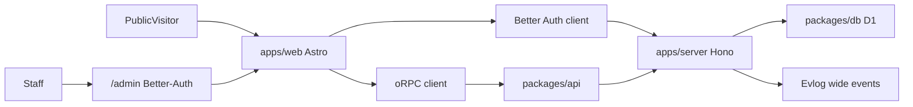

# Travel Kairos

## Vision

Build a fast, SEO-optimized, highly responsive travel agency platform. It serves public visitors looking for holiday deals and internal staff who manage inventory and customer bookings.

## Stack

| Layer | Choice |
| --- | --- |
| Frontend | Astro |
| Docs | [Starlight](https://starlight.astro.build/) |
| Backend | Hono |
| Hosting | Cloudflare Workers |
| API | oRPC |
| ORM | Drizzle |
| Database | Cloudflare D1 |
| Auth | Better Auth |
| Observability | Evlog |

## Architecture

One Turborepo product, not a separate admin app. Public marketing and deals live on Astro. Product docs live in a separate Starlight app (`apps/docs`). Staff UI lives under `/admin` and is strictly protected by Better Auth middleware.

## Implementation map

Put new work in these packages:

- **Astro** (`apps/web`): routing and static/hybrid/SSR. Public pages vs `/admin`.
- **Starlight** (`apps/docs`): documentation site. Pages are Markdown/MDX in `src/content/docs/`; sidebar and site config live in `astro.config.mjs`. Do not put docs into `apps/web`. See [Starlight](https://starlight.astro.build/).
- **Hono + Workers** (`apps/server/src/index.ts`): business logic, Better Auth at `/api/auth/*`, oRPC at `/rpc`. Infra is Alchemy in `packages/infra`, not wrangler.toml. Follow [`.agents/skills/alchemy/SKILL.md`](.agents/skills/alchemy/SKILL.md) for login, docs, and deploys.
- **oRPC** (`packages/api`): API schemas and procedures. The Astro client in `apps/web/src/lib/orpc.ts` uses `AppRouterClient` for compile-time safety. Customer APIs use `protectedProcedure`. Staff APIs use `staffProcedure` (role `agent|admin` + TOTP) or `adminProcedure`.
- **Drizzle + D1** (`packages/db`): schema and queries against Cloudflare D1. Auth tables exist; inventory and bookings schema is still to come.
- **Better Auth** (`packages/auth/src/index.ts`): admin + twoFactor plugins with roles `user` (customers), `agent`, and `admin`. Staff HTML under `/admin` is a client shell; the security boundary is oRPC + Better Auth admin endpoints. Bootstrap the first operator by signing up at `/signup`, then `pnpm promote-admin <email>` while `pnpm dev` is running.
- **Evlog**: wide events on the Hono worker in `apps/server/src/index.ts` — one structured JSON payload per request combining user info, DB queries, and errors. Astro request logging in `apps/web/src/middleware.ts` is not the backend wide-event path.

## Current vs intent

Today this is two Cloudflare Workers (`apps/web` + `apps/server`). Auth cookies live on the API origin, so Astro HTML cannot server-gate `/admin` yet. `/admin` exists as a staff portal (login, required TOTP, mock dashboard, admin-only agent provisioning). Keep enforcing staff access on `staffProcedure` / `adminProcedure`, not client-only checks.
